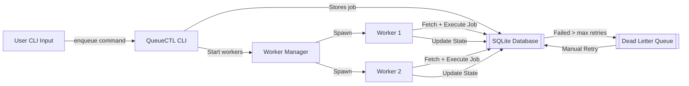
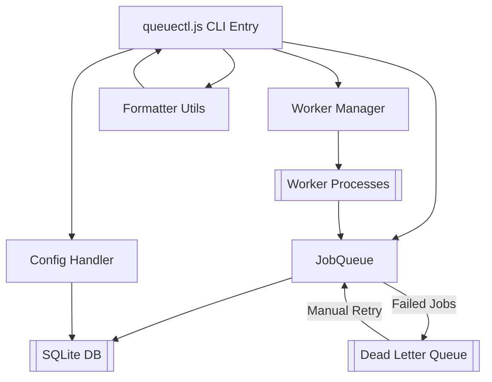
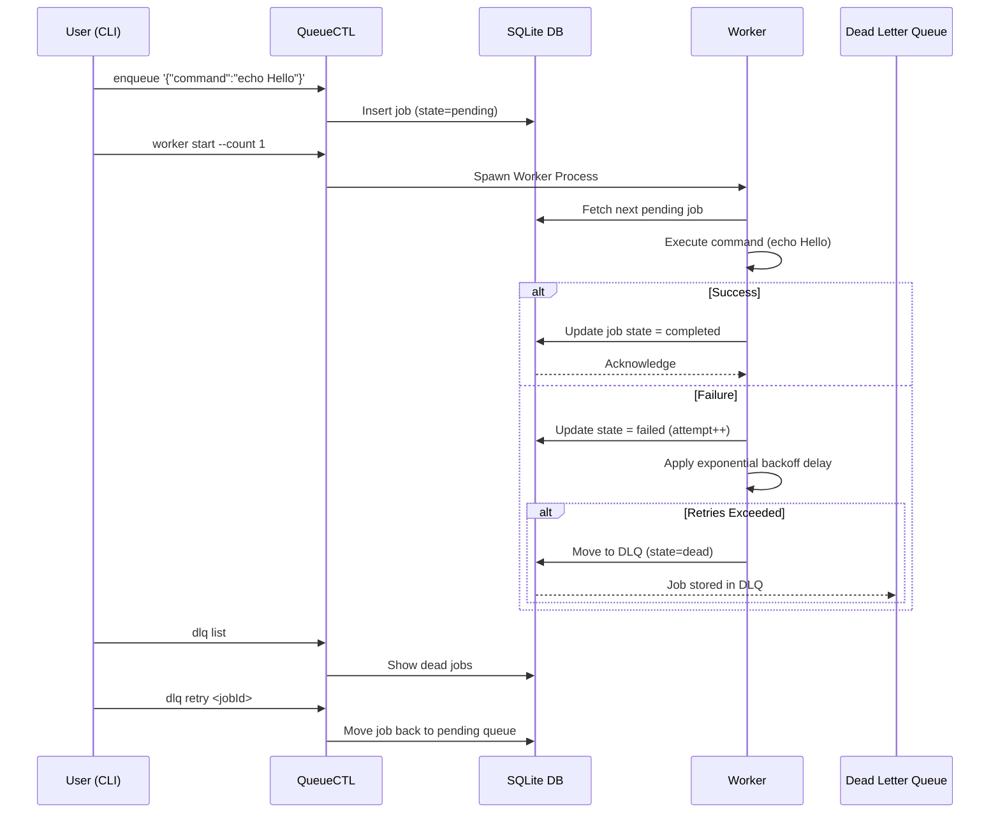

# QueueCTL — CLI-Based Background Job Queue System

**QueueCTL** is a simple, production-grade job queue CLI built with **Node.js** and **SQLite**.  
It manages background jobs, workers, retries, exponential backoff, and a **Dead Letter Queue (DLQ)** — all accessible through a clean command-line interface.

---

## ✨ Features
- 🧩 CLI-based job management  
- ⚙️ Background workers  
- 🔁 Automatic retries  
- 📉 Exponential backoff  
- 🗳️ Dead Letter Queue (DLQ)  
- 💾 Lightweight and persistent (SQLite-powered)

---

## 🛠️ Built With
- **Node.js**
- **SQLite (better-sqlite3)**
- **Commander.js**

Perfect for developers who want a **lightweight**, **reliable**, and **scriptable** job queue system without external dependencies.

---

## 🚀 System Overview


---
## 🔄 Flow Explanation

1. **User enqueues a job via CLI.**  
2. The job is stored persistently in SQLite (`pending`).  
3. **WorkerManager** spawns one or more workers.  
4. **Workers** pick pending jobs, execute them, and update their state (`completed`, `failed`, or `dead`).  
5. **Failed jobs** with retries left are re-queued; permanently failed ones move to the **DLQ (Dead Letter Queue)**.

---

## 💼 Tech Stack

| **Component**        | **Technology**                     |
|-----------------------|------------------------------------|
| **Language**          | Node.js                            |
| **Database**          | SQLite (via better-sqlite3)        |
| **CLI Framework**     | Commander.js                       |
| **Process Management**| child_process (fork/exec)          |
---
## 🧩 Architecture Overview

## 🧩 Architecture Overview



## 🧩 Modules Summary

| **Module**         | **Responsibility**                                                |
|--------------------|------------------------------------------------------------------|
| **queuectl.js**     | CLI entry point connecting all commands                          |
| **JobQueue.js**     | Handles enqueue, state management, and DLQ operations            |
| **WorkerManager.js**| Spawns and manages worker processes                              |
| **Worker.js**       | Executes commands, manages retries/backoff                       |
| **Config.js**       | Handles runtime configuration                                    |
| **formatter.js**    | Beautifies CLI table and JSON outputs                            |

---

## ⚙️ Setup & Installation

```bash
git clone https://github.com/okroshan4u/queuectl.git
cd queuectl
npm install
```
---
# 🚀 Usage Examples

## 1. Enqueue a Job
```bash
node queuectl.js enqueue "[{\"command\":\"echo Hello QueueCTL\"}]"
```
## 2. View Jobs
```bash
node queuectl.js list
```
## 3. Start Workers
```bash
node queuectl.js worker start --count 2
```
## 4. Stop Workers
```bash
node queuectl.js worker stop
```
## 5. Check Queue Status
```bash
node queuectl.js status
```
## 6. Manage DLQ
```bash
node queuectl.js dlq list
node queuectl.js dlq retry <jobId>
```
## 7. Update Config
```bash
node queuectl.js config set max-retries 5
node queuectl.js config set backoff-base 2
node queuectl.js config get
```
---
## 🧪 Test Workflow
```bash
# Enqueue a test job
node queuectl.js enqueue "{\"command\":\"echo Test Job\"}"

# Start a worker
node queuectl.js worker start --count 1

# Verify completed jobs
node queuectl.js list --state completed
```
## 📊 Job Lifecycle
```bash
stateDiagram-v2
    [*] --> Pending
    Pending --> Processing : Picked by Worker
    Processing --> Completed : Command Success
    Processing --> Failed : Command Error
    Failed --> Pending : Retry with Backoff
    Failed --> Dead : Retries Exhausted
    Dead --> Pending : Manual DLQ Retry
```
---
## 🔁 Job Execution Sequence

---
## ⚡ Performance & Reliability

- **Concurrency** — multiple worker processes can execute jobs simultaneously.  
- **Persistence** — SQLite ensures job data survives restarts and crashes.  
- **Fault-tolerance** — failed jobs are retried with exponential backoff.  
- **Resilience** — permanently failed jobs move to DLQ for manual handling.  
- **Configurable** — retry count and backoff base adjustable via CLI.  

---

## 🧠 Design Decisions & Trade-offs

1. **SQLite over JSON files** → chosen for durability, concurrency, and simplicity.  
2. **Child processes for workers** → ensures isolation; one job crash doesn’t stop others.  
3. **Commander.js for CLI** → intuitive, modern command-line management.  
4. **Exponential backoff (2^n)** → prevents retry storms during repeated failures.  
5. **Polling-based workers** → simple and effective for lightweight background processing.  

---

## 🚀 Future Improvements

- ⏱️ Job timeouts  
- 🕒 Scheduled / Delayed jobs  
- 🔝 Priority queue support  
- 🖥️ Web dashboard for monitoring  
- 🐳 Docker containerization  
---

## 🧪 Testing Instructions

---

### ✅ Case 1: Successful Job

```bash
node queuectl.js enqueue "{\"command\":\"echo Success Job\"}"
node queuectl.js worker start --count 1
```
### Expected Output:
```bash
[Worker] Processing job ...
[Worker] Job completed successfully.
```
### ❌ Case 2: Failing Job with Retries
```bash
node queuectl.js enqueue "{\"command\":\"invalidcommand\"}"
node queuectl.js worker start --count 1

```
#### Expected Behavior:

    - 🔁 Job will retry with exponential backoff.

    - 📦 After max-retries, it moves to the DLQ (Dead Letter Queue)
## 🤝 Contributing

Contributions, issues, and feature requests are welcome!  
Feel free to fork this repository and submit a pull request.

---

## 📄 License

This project is licensed under the **MIT License** — free to use, modify, and distribute.

---

## 👨‍💻 Author

**Roshan Kumar Ram**  
*Software Developer | NIT Rourkela*  

📧 [okroshan4u@gmail.com](mailto:okroshan4u@gmail.com)  
🔗 [GitHub](https://www.github.com/okroshan4u)
